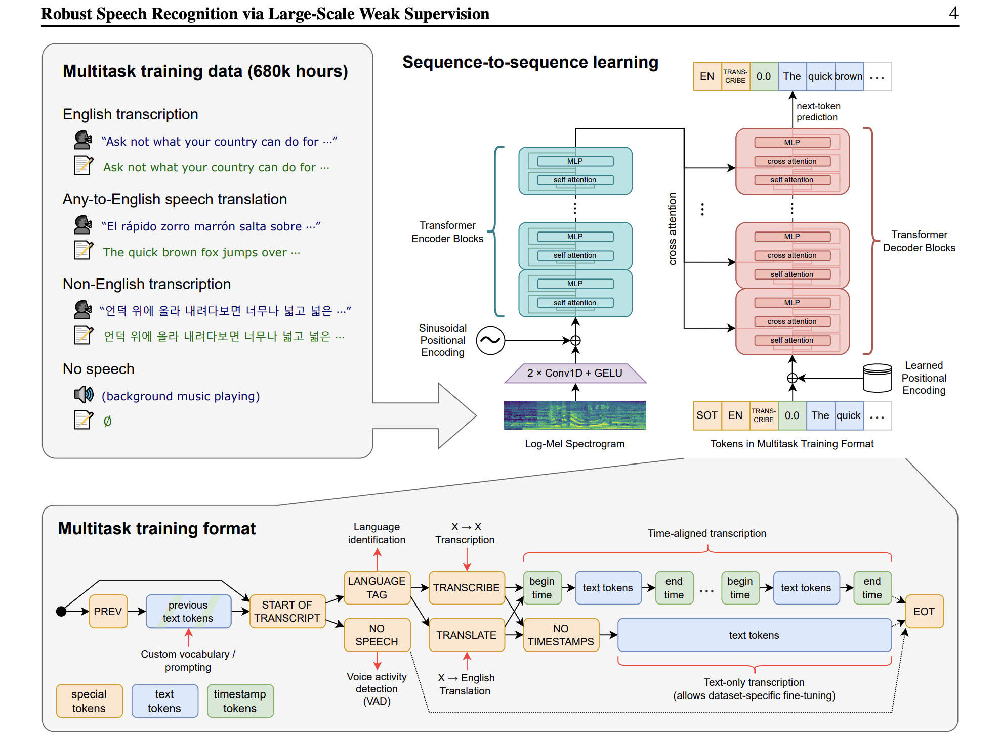

# Domain Knowledge: Audio, Transcription, and Embeddings

Practical knowledge gained while building a Sawt.

## Sample Rate

Audio is a continuous wave of air pressure changes. To store it digitally, we measure (actually we "sample") that
pressure at
regular intervals. The **sample rate** is how many measurements per second we take, expressed in Hz. CD-quality audio
uses 44,100 Hz (44.1 kHz), meaning 44,100 pressure readings per second. YouTube audio is typically 48 kHz.

Higher sample rates capture higher frequencies (up to half the sample rate, per
the[ Nyquist theorem](https://en.wikipedia.org/wiki/Nyquist%E2%80%93Shannon_sampling_theorem) — so 48 kHz can
represent sounds up to 24 kHz). But for speech recognition, most useful information lives below 8 kHz, which is why
Whisper works at 16 kHz — it's enough to capture all speech detail while keeping the data small.

When a tool receives audio at the wrong sample rate, the timing of everything is off. A 48 kHz file interpreted as 16
kHz plays at 3x speed — the model "hears" chipmunk audio and produces nonsense. The output is hallucinated text that can 
look superficially plausible but bears no relation to the actual content.

## Channels: Mono vs Stereo

Audio files can have multiple channels. Stereo has two (left and right), stored as interleaved samples:
`[L0, R0, L1, R1, ...]`. Speech models expect **mono** (a single channel). Converting stereo to mono is typically done
by averaging each pair: `mono[i] = (left[i] + right[i]) / 2`. This is a lossy operation but perfectly fine for speech —
spatial information isn't relevant to transcription.

## Sample Formats: Integer vs Float

WAV files store each sample as either an integer or a float:

- **Integer** (most common): 16-bit signed (`pcm_s16le`), range `[-32768, 32767]`. This is what ffmpeg produces by
  default.
- **Float**: 32-bit (`f32`), range `[-1.0, 1.0]`. This is what most ML inference engines expect.

To convert: divide the integer sample by `2^(bits - 1)`. For 16-bit, that's `sample / 32768.0`. Getting this wrong (
forgetting to normalize, or using the wrong divisor) produces audio that's either nearly silent or clipped, and the
model can't decode it.

## WAV File Structure

WAV is a container format with a header describing the audio data: sample rate, bit depth, channel count, sample format.
Libraries like `hound` (Rust) or Python's `wave` module parse this header to know how to interpret the raw bytes that
follow. The header is why you can't just feed raw [PCM bytes](https://en.wikipedia.org/wiki/Pulse-code_modulation) to a tool 
as it wouldn't know the sample rate or format.

## How Whisper Works (Simplified)

[Whisper](https://cdn.openai.com/papers/whisper.pdf) is an encoder-decoder transformer trained on 680,000 hours of multilingual audio. 
The pipeline is:

1. **PCM audio** (raw samples) → **log-mel spectrogram** (a visual representation of frequency content over time, 80
   frequency bands)
2. Spectrogram → **encoder** (produces a learned representation of the audio)
3. Encoder output → **decoder** (autoregressively generates text tokens, like a language model)

The spectrogram step is why the sample rate matters so much — it directly maps time-domain samples to frequency bins.
Wrong sample rate = wrong frequencies = garbage spectrogram.

**Beam search** is the decoding strategy: instead of greedily picking the most likely next token, the decoder maintains
the top N (beam size) candidate sequences and picks the overall best one. Beam size 5 is a common default — higher
values are more accurate but exponentially slower.

## Resampling: Who Does It?

This is a critical implementation detail that varies across tools:

- **Python's `faster-whisper`** (CTranslate2): handles resampling internally via bundled ffmpeg. You can pass any audio
  format and it just works.
- **whisper.cpp** (used by `whisper-rs` in Rust): does **no** resampling. It trusts that input is 16 kHz mono f32. Feed
  it anything else and it silently produces wrong results.

In sawtrs, we solve this at the source: yt-dlp's ffmpeg postprocessor converts to 16 kHz mono during download (
`--postprocessor-args "ffmpeg:-ar 16000 -ac 1"`). This is more robust than resampling later, because every WAV in the
system is guaranteed to be in the right format.

## Whisper Model Formats

The same Whisper model architecture can be packaged in different inference formats:

- **GGML** (`.bin`): Used by whisper.cpp. Quantized for CPU inference.
- **CTranslate2**: Used by faster-whisper. Different quantization format (int8, float16).

These are **not interchangeable**. A CTranslate2 model won't load in whisper.cpp and vice versa.

Model sizes range from `tiny` (~75 MB) to `large-v3` (~3 GB). The `large-v3-turbo` variant offers a good accuracy/speed
tradeoff for local use. Larger models hallucinate more confidently when given bad input — a small model might output
silence or short garbage, while a large model will write fluent paragraphs of invented text.

## Embeddings and Vector Search

### What Are Embeddings?

An embedding is a fixed-length vector of floats (e.g. 768 dimensions) that represents the "meaning" of a piece of text
in a high-dimensional space. Texts with similar meanings end up close together in this space. This is what makes
semantic search possible — instead of matching keywords, you compare the geometric distance between meaning vectors.

Embedding models are trained on massive text corpora to learn these representations. Different models produce different
dimensionalities: `nomic-embed-text` outputs 768 dimensions, OpenAI's `text-embedding-3-small` outputs 1536. The
dimensionality is fixed per model — every input, whether one word or a full paragraph, becomes a vector of exactly that
length.

### Ollama as an Embedding Server

In Python, libraries like `sentence-transformers` or ChromaDB bundle embedding models directly. In Rust, the ecosystem
for running transformer models locally is less mature. Rather than pulling in heavy ML dependencies (`rust-bert`,
`candle`), sawtrs uses [Ollama](https://ollama.com) as a local sidecar: it runs the embedding model in a separate
process and exposes a simple HTTP API (`POST /api/embed`). This keeps the Rust binary lean — it only needs an HTTP
client (`reqwest`), not an ML runtime.

The tradeoff is an external dependency: users must install Ollama and pull the model (`ollama pull nomic-embed-text`)
before using store/search/pipeline commands. But Ollama is a single binary, runs on all platforms, and the model
download is a one-time step.

### HNSW: How Vector Search Works

Brute-force nearest-neighbor search (comparing the query against every stored vector) is O(n) and too slow for large
datasets. HNSW (Hierarchical Navigable Small World) is an approximate algorithm that builds a multi-layer graph where
each node is a vector and edges connect nearby neighbors. Search starts at the top layer (sparse, long-range jumps) and
descends to lower layers (dense, fine-grained) — similar to skip lists. This gives O(log n) search time with high
recall (typically >95% of true nearest neighbors).

Key HNSW parameters:
- **connectivity** (`M`): max edges per node. Higher = more accurate but more memory. 16 is a common default.
- **expansion_add** (`ef_construction`): beam width during insertion. Higher = better graph quality but slower inserts.
- **expansion_search** (`ef`): beam width during search. Higher = more accurate but slower queries.

### Cosine Similarity vs Distance

Cosine similarity measures the angle between two vectors, ignoring magnitude: `cos(A, B) = dot(A, B) / (|A| * |B|)`.
It ranges from -1 (opposite) to 1 (identical). Cosine **distance** is `1 - cosine_similarity`, so 0 means identical
and 2 means opposite. usearch uses cosine distance internally — lower values in search results mean better matches.

### The Two-File Approach

usearch is a pure vector index: it stores `(u64 key, float[] vector)` pairs and nothing else. It has no concept of
metadata (text, timestamps, video IDs). So we use a sidecar approach: the HNSW index lives in `index.usearch`, and a
`metadata.json` file maps each `u64` key to its `StoredSegment` (video ID, segment index, start/end times, text). Both
files must be kept in sync — every insert/delete updates both.

The `u64` key is derived deterministically from the string `{video_id}_{segment_index}` via FNV-1a hashing. This makes
re-ingestion idempotent: running the pipeline twice on the same video produces the same keys, so the second run is an
upsert (remove old + insert new) rather than a duplicate.
